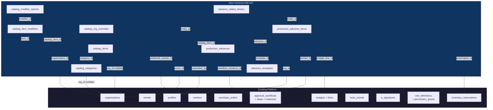

# Production Advancing Module — Scalable Integration Roadmap

> **Version:** 1.1 | **Date:** 2026-03-06 | **Status:** Planning  
> **Dependencies:** Migrations 001–044, RBAC 6-tier (038), Workflow Engine (006), Live Ops (020)  
> **v1.1 changes:** Hybrid catalog architecture (platform-standardized + org overrides), IA integration map, open questions resolved

---

## 1. Existing Asset Audit

### 1.1 Master Catalog Tables

| Asset | Status | Reference |
|---|---|---|
| `catalog_categories` | **NOT FOUND** | No catalog tables in any migration. Must create. |
| `catalog_items` (329 items) | **NOT FOUND** | Must create with seed data. |
| `catalog_item_modifiers` | **NOT FOUND** | Must create. |
| `catalog_modifier_options` | **NOT FOUND** | Must create. |

**Assessment:** Entire Master Catalog is net-new. Closest existing structures (`consumables` in 003, `kits`/`kit_items` in 019) don't model a browsable catalog with modifiers.

### 1.2 Events Table — CONFIRMED

| Asset | Reference | Notes |
|---|---|---|
| `events` | `003:183` | Full metadata, project/location/activation FKs, type/status enums, `organization_id` |
| `live_event_instances` | `020:81` | 1:1 extension with `live_event_phase` enum — includes `'advance'` as first phase |

### 1.3 Vendors / Contacts — CONFIRMED

| Asset | Reference | Notes |
|---|---|---|
| `vendors` | `001:209` | name, contact, compliance fields, rating, status, `organization_id` |
| `purchase_orders` + `purchase_order_items` | `001:229,244` | PO generation infrastructure exists |
| `vendor_capabilities` | `021` | Vendor-to-vertical mapping |
| `rental_agreements` + lines | `021` | Full rental lifecycle |

### 1.4 Users / RBAC — CONFIRMED

| Asset | Reference | Notes |
|---|---|---|
| `org_memberships` | `018:147` | Multi-org with per-org roles |
| `role_definitions` + `permission_grants` | `028:19,38` | DB-backed custom roles, ~200 seeded grants |
| 6-tier RBAC | `038` | exec, director, pm, member, client, collaborator |
| `PERMISSION_MATRIX` | `src/config/rbac.ts:18` | Static + DB grant fallback via `hasPermission()` |

### 1.5 Budget Module — CONFIRMED

| Asset | Reference | Notes |
|---|---|---|
| `budgets` | `003:895` | Project-scoped, versioned, totals, `organization_id` |
| `production_budget_lines` | `003:934` | 24-value category enum, vendor FK, quantity/cost |
| `budget_approvals` + `payment_approvals` | `016:750,804` | Payment type enum includes `'advance'` |

### 1.6 Approval Workflow Engine — CONFIRMED (Critical Finding)

| Asset | Reference | Notes |
|---|---|---|
| `approval_workflows` | `006:203` | Configurable per entity_type, auto-escalation, delegation |
| `approval_steps` | `006:233` | Multi-step, role/user approvers, conditions JSONB, escalation |
| `workflow_instances` | `006:268` | Entity-bound with status lifecycle |
| `workflow_step_approvals` | `006:303` | Per-step decisions with delegation tracking |

**The prompt's proposed `advance_approval_workflows` + `advance_approval_steps` are REDUNDANT.** We register `'production_advance'` as `entity_type` in the existing engine. This preserves SSOT.

### 1.7 Additional Leverageable Assets

| Asset | Reference | Relevance |
|---|---|---|
| `e_signatures` | `006:335` | Digital sign-off for delivery confirmations |
| `scan_events` | `019:414` | Barcode scanning for delivery check-in |
| `inventory_reservations` | `019:258` | Time-bound allocation locks, double-booking prevention |
| `shipments` + `shipment_items` | `003:790`, `019:303` | Delivery tracking infrastructure |
| `kits` + `kit_items` | `019:346` | Reusable equipment groupings |

---

## 2. Schema Migration Plan

### Design Decisions

1. **Reuse existing approval engine** (migration 006) — register `'production_advance'` as entity_type
2. **Reuse `inventory_reservations`** — for catalog item double-booking prevention
3. **Reuse `e_signatures`** — for delivery sign-offs
4. **Reuse `scan_events`** — for barcode check-in
5. **Create Master Catalog** — 5 new tables (categories, items, modifiers, options, org_overrides). Hybrid architecture: platform-standardized taxonomy + per-org pricing/vendor overrides.
6. **Create Production Advances** — 4 new tables (advances, items, history, templates)
7. **Extend `record_comments`** — for advance comments (not a new table)

### Migration 045: Master Catalog (Hybrid: Platform-Standardized + Org Overrides)

**Architecture Decision: Two-Layer Catalog**

The catalog uses a **platform-standardized taxonomy** with **per-org pricing/vendor overrides**. This enables:
- Industry-wide naming convention standardization (no "Mic #3" vs "Shure SM58" drift)
- Platform-wide trend analytics ("LED Par Cans = #1 item across 47 events this quarter")
- Vendor benchmarking across orgs (who gets the best price for the same item?)
- Consistent reporting regardless of org-level pricing differences

| Layer | Scope | `organization_id` | Contains |
|---|---|---|---|
| **Platform Catalog** | Global | `NULL` | Canonical names, categories, specs, modifiers, make/model, tags, `is_critical_path` defaults |
| **Org Overrides** | Per-org | FK to `organizations` | `unit_cost`, `currency`, vendor prefs, availability, visibility, pricing notes |
| **Org Custom Items** | Per-org | FK to `organizations` | Org-specific items not in platform catalog (flagged `is_custom = true`) |

**New tables:** `catalog_categories`, `catalog_items`, `catalog_item_modifiers`, `catalog_modifier_options`, `catalog_org_overrides`

**New enums:**
- `catalog_category_type`: `access, production, technical, hospitality, travel, custom`
- `catalog_item_status`: `active, discontinued, out_of_stock, seasonal, draft`
- `modifier_type`: `single_select, multi_select, quantity, text, boolean`

**Key design points:**
- `catalog_categories`: 3-level hierarchy (type → category → subcategory) via `parent_id` self-FK, `depth` check constraint. Platform categories have `organization_id IS NULL`.
- `catalog_items`: Full-text search via `TSVECTOR GENERATED ALWAYS AS` (weighted: name=A, make/model=A, description=B, tags=C), GIN index
- `catalog_items`: Platform items (`organization_id IS NULL`) define the canonical taxonomy. Org custom items (`organization_id IS NOT NULL`, `is_custom = true`) are org-scoped only.
- `catalog_items`: `specifications` JSONB for make, model, dimensions, weight, power requirements — standardized at platform level
- `catalog_org_overrides` (NEW): Junction table `(organization_id, catalog_item_id)` UNIQUE. Fields: `unit_cost`, `currency`, `preferred_vendor_id` FK, `available_quantity`, `reserved_quantity` (denormalized, synced from `inventory_reservations`), `is_active` (org can deactivate platform items), `pricing_notes`, `lead_time_days`, `minimum_order_quantity`. RLS: org members read own, admin write own.
- `catalog_item_modifiers`: Typed modifier groups (single/multi select, quantity, text, boolean) with min/max selections. Platform-level modifiers (`organization_id IS NULL`) define standard options; orgs cannot rename platform modifiers.
- `catalog_modifier_options`: Per-option price adjustments (flat, percentage, or per_unit). Platform-level defines standard options; org-level pricing via `catalog_org_overrides`.
- Platform tables: RLS read = authenticated (all users can browse platform catalog); write = platform admin only (future: superadmin role)
- Org tables: RLS read via `get_user_org_ids()`; write via `get_user_admin_org_ids()`
- Soft deletes (`deleted_at`) on all tables
- Trigger: `sync_category_item_count()` maintains denormalized `item_count` on categories
- Trigger: `sync_org_override_reservation_counts()` syncs `available_quantity`/`reserved_quantity` on `catalog_org_overrides` from `inventory_reservations`

**Query pattern for org catalog view:**
```sql
SELECT ci.*, COALESCE(coo.unit_cost, ci.default_unit_cost) AS effective_cost,
       COALESCE(coo.is_active, true) AS is_active,
       coo.preferred_vendor_id, coo.available_quantity
FROM catalog_items ci
LEFT JOIN catalog_org_overrides coo
  ON coo.catalog_item_id = ci.id AND coo.organization_id = :org_id
WHERE ci.organization_id IS NULL              -- platform items
  AND COALESCE(coo.is_active, true) = true    -- not deactivated by org
UNION ALL
SELECT ci.*, ci.default_unit_cost, true, NULL, ci.available_quantity
FROM catalog_items ci
WHERE ci.organization_id = :org_id            -- org custom items
  AND ci.deleted_at IS NULL;
```

**Seed strategy:** Platform seed via migration SQL (categories + skeleton items). Exact item data loaded via CSV import Edge Function — this is a data decision, not an engineering decision. The client team provides the item spreadsheet.

### Migration 046: Production Advances Core

**New tables:** `production_advances`, `production_advance_items`, `advance_status_history`, `advance_templates`

**New enums:**
- `advance_type`: `pre_event, load_in, show_day, strike, post_event`
- `advance_status`: `draft, submitted, in_review, approved, in_progress, fulfilled, completed, cancelled`
- `advance_priority`: `low, medium, high, urgent, critical`
- `advance_item_status`: `pending, confirmed, in_transit, delivered, installed, operational, struck, returned, complete`

**`production_advances` key fields:**
- `advance_number` — auto-generated via sequence trigger (`PA-2026-0001`)
- `event_id` FK (RESTRICT), `project_id` FK (SET NULL), `submitted_by`, `point_of_contact`
- `advance_type`, `status`, `priority`
- `service_start_date`, `service_end_date`, `service_duration_days` (GENERATED ALWAYS)
- `total_estimated_cost`, `total_actual_cost`, `total_items` — denormalized, synced by trigger (documented justification: avoids aggregate on every list render)
- `workflow_instance_id` FK → existing `workflow_instances`
- `source_template_id` FK → `advance_templates`
- Soft delete, full audit timestamps

**`production_advance_items` key fields:**
- `advance_id` FK (CASCADE), `catalog_item_id` FK (RESTRICT), `vendor_id`, `assigned_to`
- `quantity_requested`, `quantity_confirmed`, `selected_modifiers` (JSONB)
- `status` (9-stage lifecycle), `unit_cost`, `total_cost` (GENERATED ALWAYS)
- `scheduled_delivery`, `actual_delivery`, `load_in_time`, `strike_time`
- `delivery_zone`, `delivery_location`, `is_critical_path`, `dependencies` (UUID[])
- `budget_line_id` FK → `production_budget_lines`, `reservation_id` FK → `inventory_reservations`
- Auto-timestamps per status via trigger

**`advance_status_history`:** Polymorphic audit trail (`entity_type` IN advance/advance_item), immutable, with metadata JSONB snapshots.

**`advance_templates`:** Reusable order templates with JSONB `template_items` array, public/personal sharing, use_count tracking.

**Triggers:**
- `sync_advance_totals()` — updates parent totals on item INSERT/UPDATE/DELETE
- `log_advance_status_change()` — creates history record + sets timestamps on advance status transition
- `log_advance_item_status_change()` — creates history record + sets timestamps on item status transition

**Status transition validation functions:**
- `validate_advance_status_transition(current, new)` — IMMUTABLE, called by API routes
- `validate_advance_item_status_transition(current, new)` — IMMUTABLE, called by API routes

**RLS:** All tables use `get_user_org_ids()` for read, submitter + admin for update, admin for delete.

### Migration 047: RBAC Permission Grants

Seeds `permission_grants` for new resources:

| Resource | exec | director | pm | member | client | collaborator |
|---|---|---|---|---|---|---|
| `catalog` | manage | read+write | read+write | read | read | read |
| `production_advances` | manage | read+write | read+write | read+write | read | read |
| `advance_templates` | manage | read+write | read+write | read | — | — |
| `advance_admin` | manage | read+write | read | — | — | — |

Also seeds a default `approval_workflows` row with `entity_type = 'production_advance'` per organization.

---

## 3. Component Architecture Map

```
src/
├── app/(dashboard)/advancing/
│   ├── page.tsx                    # "My Advances" list
│   ├── new/page.tsx                # Full flow: Browse → Cart → Checkout → Submit
│   ├── [id]/page.tsx               # Advance detail (track & manage)
│   ├── [id]/edit/page.tsx          # Edit draft advance
│   ├── catalog/page.tsx            # Standalone catalog browse (admin)
│   ├── queue/page.tsx              # Admin: review queue
│   ├── fulfillment/page.tsx        # Admin: fulfillment tracking
│   ├── inventory/page.tsx          # Admin: inventory dashboard
│   ├── templates/page.tsx          # Template management
│   └── reports/page.tsx            # Analytics & reporting
├── components/advancing/
│   ├── catalog-browser.tsx         # Category tabs + search + item grid
│   ├── catalog-item-card.tsx       # Item card with availability badge
│   ├── catalog-item-detail.tsx     # Item detail modal/slide-over
│   ├── advance-cart.tsx            # Persistent cart sidebar/bottom sheet
│   ├── advance-cart-item.tsx       # Cart line item
│   ├── advance-checkout-form.tsx   # Multi-step checkout
│   ├── advance-review-summary.tsx  # Pre-submit review
│   ├── advance-status-badge.tsx    # Status badge
│   ├── advance-status-timeline.tsx # Visual state machine
│   ├── advance-item-row.tsx        # Line item row
│   ├── advance-approval-panel.tsx  # Approval actions
│   ├── advance-comments-thread.tsx # Internal/external comments
│   ├── advance-quick-actions.tsx   # Swipe status updates (mobile)
│   ├── advance-template-picker.tsx # Template selection
│   ├── inventory-conflict-alert.tsx# Double-booking warning
│   └── index.ts                    # Barrel export
├── hooks/use-advance-cart.ts       # Zustand cart state (client-side)
├── lib/supabase/
│   ├── hooks-advancing.ts          # React Query hooks for all advancing tables
│   └── realtime-advancing.ts       # Supabase Realtime subscriptions
├── config/advancing-config.ts      # SSOT: status configs, transitions, labels, icons
├── types/advancing.ts              # TypeScript types
└── app/api/
    ├── advancing/
    │   ├── route.ts                # GET list / POST create
    │   ├── [id]/route.ts           # GET / PATCH / DELETE
    │   ├── [id]/submit/route.ts    # POST submit (draft → submitted)
    │   ├── [id]/approve/route.ts   # POST approve
    │   ├── [id]/reject/route.ts    # POST reject
    │   ├── [id]/cancel/route.ts    # POST cancel
    │   ├── [id]/items/route.ts     # GET / POST items
    │   ├── [id]/items/[itemId]/route.ts       # PATCH / DELETE item
    │   ├── [id]/items/[itemId]/status/route.ts # POST status transition
    │   └── templates/route.ts      # GET / POST templates
    └── catalog/
        ├── route.ts                # GET categories + items
        ├── search/route.ts         # GET full-text search
        └── [id]/route.ts           # GET item detail
```

**Edge Functions** (new `supabase/functions/` directory):
- `advance-notifications/` — Notification dispatch on status changes
- `advance-escalation/` — SLA breach detection + escalation (cron-triggered)
- `advance-vendor-po/` — Auto-generate PO from approved items

---

## 4. UX Flow Mapping (6-Step E-Commerce Pattern)

### Step 1 — Browse Catalog ("Menu")
- **Route:** `/advancing/new` (step 1)
- **Component:** `<CatalogBrowser />`
- **Data:** `useCatalogCategories()`, `useCatalogItems(categoryId, filters)`
- **RBAC:** exec, director, pm, member
- **UX:** 6 category tabs → subcategory chips → searchable item grid with availability badges + lead time indicators

### Step 2 — Item Detail ("Customize")
- **Route:** Modal overlay on `/advancing/new`
- **Component:** `<CatalogItemDetail />`
- **Data:** `useCatalogItem(id)`, `useCatalogModifiers(itemId)`
- **UX:** Specs table, modifier groups (radio/checkbox/quantity/text), quantity selector, price calculation, "Add to Advance" CTA

### Step 3 — Cart Review ("Your Advance Request")
- **Route:** Persistent sidebar (desktop) / bottom sheet (mobile)
- **Component:** `<AdvanceCart />` + `<AdvanceCartItem />`
- **Data:** Client-side Zustand (`useAdvanceCart`)
- **UX:** Edit/remove per item, drag-to-reorder, running total, "Load from Template", "Save as Draft", "Proceed to Details"

### Step 4 — Checkout Form ("Event & Delivery Details")
- **Route:** `/advancing/new` (steps 2–3)
- **Component:** `<AdvanceCheckoutForm />`
- **Data:** `useEvents()`, `useProfiles()`
- **UX:** 3 sub-steps: Event Info → Dates & Logistics → Purpose/Notes. Save as Draft at any point.

### Step 5 — Review & Submit ("Confirm")
- **Route:** `/advancing/new` (final step)
- **Component:** `<AdvanceReviewSummary />`
- **Data:** Cart + form state → `useSubmitAdvance()` mutation
- **Submit triggers:** Availability re-check → create items → set `submitted` → create `workflow_instance` → create `inventory_reservations` → fire notification

### Step 6 — Track & Manage ("My Advances")
- **Route:** `/advancing` (list), `/advancing/[id]` (detail using `DetailLayout`)
- **Data:** `useAdvances()`, `useAdvance(id)`, `useAdvanceItems(id)`, `useAdvanceHistory(id)`
- **Detail tabs:** Overview, Items (with status timeline per item), Approval (workflow progress), Activity (audit feed), Comments

---

## 5. Admin Operations

| Feature | Route | RBAC | Key Capabilities |
|---|---|---|---|
| **Advance Queue** | `/advancing/queue` | exec(manage), director(rw), pm(r) | Filterable list, bulk approve/reject, SLA indicators, realtime |
| **Review & Approve** | `/advancing/[id]` (admin variant) | exec, director | Per-item approve/reject, cost adjustment, vendor assignment |
| **Fulfillment Tracking** | `/advancing/fulfillment` | exec(manage), director(rw), pm(r) | Kanban pipeline, delivery confirmation + photo, vendor response tracking |
| **Inventory Dashboard** | `/advancing/inventory` | exec, director, pm | Cross-event availability heatmap, conflict detection, low-stock alerts |
| **Vendor Coordination** | Integrated into detail + fulfillment | exec, director, pm | Auto-generate POs, track confirmations, 48h escalation |
| **Reporting** | `/advancing/reports` | exec, director(full), pm(r) | By event/category/status, budget variance, fulfillment rate, vendor performance |

---

## 6. Notifications & Automation

| Trigger | Detection | Target | Channel |
|---|---|---|---|
| Advance submitted | DB trigger on `status = 'submitted'` | Workflow assignees | Email + In-App |
| Advance approved | DB trigger on `status = 'approved'` | Submitter | Email + In-App |
| Advance rejected | DB trigger on `status` from `in_review` | Submitter | Email + In-App |
| Item status changed | DB trigger on `advance_items.status` | Submitter + assigned_to | In-App |
| Delivery overdue | Cron hourly | Admin + Submitter | Email + In-App |
| Comment added | DB trigger on `record_comments` | Thread participants | In-App |
| Vendor unresponsive (48h) | Cron daily | Admin | Email + In-App |
| Approval SLA breach (24h) | Cron hourly | Approver's manager | Email |

**Implementation:** Supabase Edge Functions invoked by database webhooks (real-time triggers) and `pg_cron` (time-based). All idempotent with dedup keys.

---

## 7. Mobile & Field Operations

| Feature | Implementation | Offline Support |
|---|---|---|
| **Offline Cart** | Service Worker + IndexedDB (`idb-keyval`). Catalog cached on first load, cart persisted locally, sync queue on reconnect. | Full |
| **Delivery Check-In** | Camera capture + `zxing-js` barcode scan + `navigator.geolocation` GPS stamp. Creates `scan_events` record, uploads photo to Storage. | Queued |
| **Digital Sign-Off** | Canvas signature capture → PNG → Supabase Storage → `e_signatures` record. | Queued |
| **Quick Status Updates** | Swipe-to-advance on mobile item list. Server-validated via `validate_advance_item_status_transition()`. | Queued |
| **Push Notifications** | Web Push API via Service Worker. Progressive permission prompt on first advance creation. | N/A |

---

## 8. Implementation Phases

| Phase | Scope | Deliverables | Complexity | Sprint Est. |
|---|---|---|---|---|
| **1** | Core Schema + CRUD | Migrations 045–047, TS types, API routes, React Query hooks, Realtime subs | M | 1–2 sprints |
| **2** | Catalog Browse + Cart UX | CatalogBrowser, ItemDetail, Cart (Zustand), Checkout, ReviewSummary, full `/advancing/new` | L | 2–3 sprints |
| **3** | Approval Workflows | Wire existing engine to `production_advance`, ApprovalPanel, status transition APIs, notifications | M | 1–2 sprints |
| **4** | Admin Operations | Queue, fulfillment, inventory dashboard, vendor PO generation, reporting | L | 2–3 sprints |
| **5** | Templates + Reporting | TemplatePicker, CRUD, analytics queries, CSV export, budget variance | S | 1 sprint |
| **6** | Mobile + Field Ops | Offline cart, delivery check-in, digital sign-off, quick status, push notifications | L | 2–3 sprints |
| **7** | AI / Automation | Smart recommendations, risk detection, predictive alerts, auto-categorization | M | 1–2 sprints |

**Total:** 10–16 sprints (20–32 weeks)

---

## 9. Dependency Diagram



**Integration points with existing modules:**

| Existing Module | Integration Point |
|---|---|
| **Events** | `production_advances.event_id` — every advance is scoped to an event |
| **Vendors** | `production_advance_items.vendor_id` — items assigned to vendors for fulfillment |
| **Budgets** | `production_advance_items.budget_line_id` — cost tracking against budget lines |
| **Purchase Orders** | Auto-generated from approved items via Edge Function |
| **Approval Workflows** | `production_advances.workflow_instance_id` — reuses existing engine |
| **Inventory** | `production_advance_items.reservation_id` — time-bound allocation locks |
| **Scan Events** | Delivery check-in creates `scan_events` records |
| **E-Signatures** | Vendor delivery + installation sign-offs |
| **Crew/Shifts** | Future: crew assignment per advance item for load-in/strike |
| **Timeline/Schedule** | Future: advance items appear on project Gantt/calendar |

---

## 10. Information Architecture Integration

### Navigation Placement

Advancing integrates into the existing IA (10 sections + 1 contextual) with **zero new top-level nav sections**. All items use the existing two-level nesting already supported by `SidebarNavItem` in `sidebar.tsx`.

**Production section** (Tier 2 — primary domain):

```
Production
├── Projects
├── Events
├── Activations
├── Advancing              ← NEW primary entry ("My Advances" list)
│   ├── New Advance        ← 6-step browse→cart→submit flow
│   ├── Templates          ← Template management
│   └── Catalog            ← Catalog browse (admin)
├── Locations
├── Call Sheets
├── Checklists
└── Templates
```

**Admin section** (Tier 3 — governance):

```
Admin
├── ...existing items...
└── Advancing Admin        ← NEW nested group
    ├── Review Queue       ← Approval queue + bulk actions
    ├── Fulfillment        ← Delivery tracking pipeline
    ├── Inventory          ← Cross-event availability heatmap
    └── Reports            ← Analytics + budget variance
```

### RBAC Visibility

| Nav Item | exec | director | pm | member | client | collaborator |
|---|---|---|---|---|---|---|
| Advancing (list) | ✅ | ✅ | ✅ | ✅ | ✅ (own event only) | ✅ (own event only) |
| New Advance | ✅ | ✅ | ✅ | ✅ | Request mode only | — |
| Templates | ✅ | ✅ | ✅ | read | — | — |
| Catalog | ✅ | ✅ | ✅ | — | — | — |
| Advancing Admin (all) | ✅ | ✅ | read queue only | — | — | — |

RBAC filtering is handled by the existing `filterSectionsByPermission()` in `sidebar.tsx`. No sidebar code changes needed — only `navigation.ts` item additions with correct `permission` keys referencing the RBAC resources seeded in migration 047.

### Command Bar Integration

All nested items (including "New Advance", "Review Queue", etc.) are automatically discoverable via ⌘K — the existing `flattenNavItems()` in `command-bar.tsx` already traverses `children[]` arrays.

### Implementation Changes

| File | Change |
|---|---|
| `src/config/navigation.ts` | Add 4 items to Production section (`children` on Advancing), add Advancing Admin group to Admin section |
| `src/config/rbac.ts` | Already handled by migration 047 permission grants — `PERMISSION_MATRIX` entries for `catalog`, `production_advances`, `advance_templates`, `advance_admin` |
| No other files | Sidebar, command bar, topbar breadcrumbs all derive from `navigation.ts` automatically |

---

## 11. Open Questions — Resolved

| # | Question | Decision | Rationale |
|---|---|---|---|
| 1 | Catalog scoping: org-scoped or platform-shared? | **Hybrid: platform-standardized taxonomy + per-org pricing/vendor overrides** via `catalog_org_overrides`. Platform items (`organization_id IS NULL`) enforce naming standards; orgs override pricing, vendor prefs, and availability. Orgs can also add custom items (`is_custom = true`). Enables platform-wide trend analytics and vendor benchmarking. | See Migration 045 architecture decision above. |
| 2 | What are the 329 seed items and 24 categories? | **Categories map 1:1 to existing `budget_category` enum (migration 003).** Exact item data is a business decision — create a CSV import Edge Function so the client team loads items from a spreadsheet rather than hardcoding in SQL. Migration seeds the category structure only. | Avoids stale seed data; enables different tenants to import different item sets. |
| 3 | Approval cost thresholds? | **3-tier progressive: ≤$1K auto-approve (PM), $1K–$10K director, >$10K exec.** 48h/72h auto-escalation respectively. Configurable per-org via `approval_steps.conditions` JSONB — seeded values are defaults only. | Maps to 6-tier RBAC. Existing workflow engine supports threshold conditions natively. |
| 4 | Client advance submission? | **View + request mode.** Clients see advances for their events and can submit simplified requests (`client_originated: true`, `status: 'draft'`). PM reviews/finalizes before submission. Clients see a curated subset via `catalog_items.client_visible` boolean, not full catalog (protects internal pricing). | Standard agency workflow — client visibility without full catalog access. |
| 5 | Advancing coordinator role? | **No new role.** PM handles day-to-day; director handles approval/oversight. If a specific person needs elevated access at member level, use `permission_grants.conditions` JSONB for surgical override (e.g., `{ "resource_override": "advance_admin" }`). | Adding a 7th role increases platform-wide RBAC complexity for a single-module concern. |
| 6 | PO generation timing? | **Manual trigger with one-click convenience.** On approval confirmation screen: "Generate POs for N vendors?" → one click → Edge Function creates `purchase_orders` in `draft` status grouped by `vendor_id`. Admin reviews before sending. | Fully auto PO is dangerous (vendor terms, pricing negotiations need human judgment). One-click at the natural workflow point eliminates friction. |
| 7 | Inventory reservation timing? | **Optimistic: reserve on submission, release on rejection.** Creates `inventory_reservations` with `status: 'tentative'`, `hold_expires_at: NOW() + 72h` on submit. Promoted to `'confirmed'` on approval. Auto-released by `pg_cron` past expiry. | Prevents double-booking during review window. Same pattern as e-commerce cart holds (Shopify, Ticketmaster). |
| 8 | Mobile platform? | **PWA-only.** Service Worker + IndexedDB for offline, Web Push API for notifications, standard Web APIs for camera/GPS/barcode. Add `manifest.json` + install prompt. Evaluate native wrapper only if push delivery rates are insufficient on iOS or NFC/Bluetooth hardware is needed. | Capacitor/Expo adds build complexity + app store latency for capabilities PWA already provides. |
